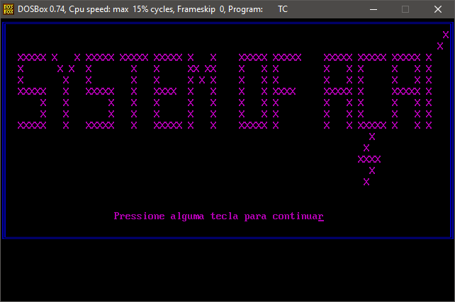
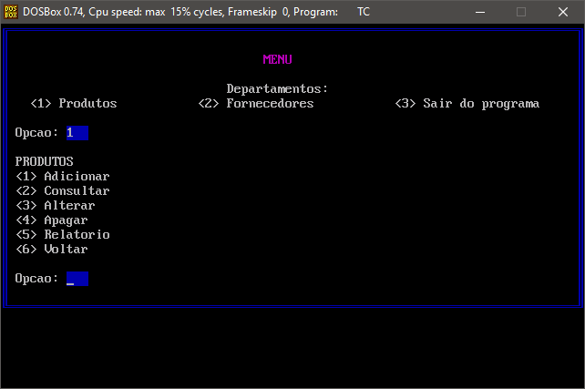

# sys-acai

  Trabalho proposto na disciplina de Linguagens e Técnicas de Programação do curso de Ciência da Computação pela professora Marly com o objetivo de praticar as técnicas aprendidas em C e C++, bem como a manipulação de arquivos .txt e .dat. 
  Além disso, o trabalho tem integração com a disciplina de Estrutura de Dados, onde o professor Marcos solicitou a implementação de estruturas definidas e geração de um relatório que é direcionado para um arquivo .txt salvo no computador. A estrutura criada foi uma lista dinâmica que é construída a partir da base de dados .dat, onde cada elemento possui um ponteiro apontando para o próximo. 
  

!!! NOTAS IMPORTANTES !!!

*O programa só pode ser rodado na IDE MSDOS Turbo C++, ou similar. Tal obrigação se faz pelo uso de recursos de interface gráfica como o método "gotoxy(x, y)", que posiciona o cursor na matriz gráfica(tela do computador);
  
*Para que o programa funcione corretamente, é preciso criar uma pasta com nome de "SACAI" no diretório "C:", pois é nesse caminho que o programa busca as bases de dados relacionadas a produtos e fornecedores. Caso as bases não existam, o programa automaticamente as cria.

CAPTUTAS DE TELA

